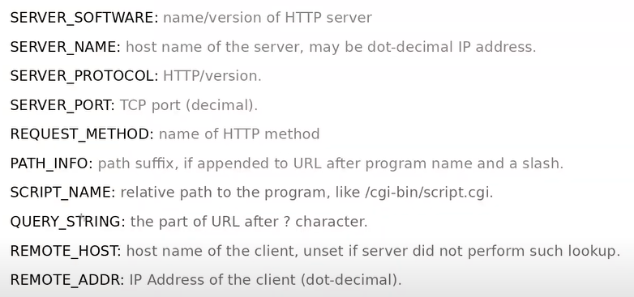

* Table of Contents
{:toc}

--------------------------------------------------------------------------------------------------------------------

DevOps is a set of practices that combines software development and IT operations. It aims to shorten the systems development life cycle and provide continuous delivery with high software quality.
[Source](https://en.wikipedia.org/wiki/DevOps)


**DevOps Automation: Continuous __**


**CI/CD Pipeline**


**DevOps Tools**


[Source](https://www.youtube.com/watch?v=JHoy3lDZOfY)

## Different environments


But because there are so many different environments, might cause the issue of the code working on one environment, but not working on another environment. Hence we put our code into containers which are isolated and standardized environments so as to ensure that the code working on one environment will be working on other environments. Dev side will put code into container and ops side will use the container and do what they need to do.

## Release Management Strategies

Release management is the process of managing, planning, scheduling and controlling a software build through different stages and environments; including testing and deploying software releases.

We need it because it is hard to estimate time that software is delivered. When dev team hands over software to QA, features might pile up on QA side. Dev team might also hand over hotfixes to QA which were not planned to be released. Then QA might find bugs in the feature and pass back to dev team to fix. So passing to and fro of the software between QA and dev makes it hard to predict when a feature will be released and to manage releases.

Goal is to deliver value to customers on time, and to make handover between the tech team and the ops teams better.

### Slow Cadence

A release window is a period of time during which one or more teams may release into production. (Eg. 1am-5am on Saturday morning) A release slot is subset within that release window during which a team may deploy their solution into production. Tends to be less frequent, either weekly, monthly etc.

Advantages:
- Consistent release cadence to business stakeholders
- Predictable release date targets for delivery teams

Disadvantages
- Dev teams are constrained to a common release schedule and its hard to implement auto delivery strategies (continuous delivery)

### Release train

Every team involved that in that train has the same release cadence. More common in large programs. If you miss the train, need to wait for next train. Disadvantage: bottleneck problems same as slow cadence.

### Quick Cadence

Many release windows and many release slots. Less prone to bottleneck challenges.

### Continuous release availability

Only model allowing continuous delivery. Teams can release deatures into production whenever needed. Several devops practices need to be implemented: 
- Fully automated deployment
- Fully automated regression testing
- Feature toggles
- Self-recovering components

[DevOps Release Management Video](https://www.youtube.com/watch?v=vlsLxaY4P7M&t=619s)

## Devops techniques for release management

### Infrastructure as Code (Configuration management)

Avoid manual configuration of infrastructure, because error prone. Harder to track also. Manages and configures servers through scripts. Devops team provides infrastructure config code, and can be in git repo too. Leads to more reliable releases. Allows for a more repeatable release process, can run in different environments. Disaster recovery also easier. Script tells how a server is configured and can see how it changed over time.

**Tools:** Chef, puppet, ansible etc

### Destroy all your servers, all the time

What to do when server crashes and we lose our environment. If environment is manually configured, hard to restore. Common problem associated with server management: **Configuration drift**. Actual configuration of server changes over time due to making changes, is a given using manual configuration, but can also happen when automated. How do we know a single run of our configuration script can put our servers into a known state? The only way to do this is to destroy our servers on purpose, as part of regular maintenance. We should also deploy servers as virtual machines so that they are easy to redeploy. This is referred to as Phoenix servers. => ensures that our config scripts are up to date.

### Zero in on zero downtime development

Blue/Green deployment: Have 2 identical deployments, set all routing (through load balancer) to active server, then run config scripts on passive server. Can simply use load balancer to redirect traffic to new environment with latest changes. So the userbase will experience no downtime in services.


[DevOps Release Management Video](https://www.youtube.com/watch?v=vlsLxaY4P7M&t=619s)

# Deployment

All the code we write needs to be put onto a server, usually frontend code put onto one server, backend code put onto another server. A server is just a public computer. The act of putting a code onto a public computer is called deployment.

## Continuous deployment

### Virtualization and containerization

Solves issue of code running on one env and not on another env. Containers wrap your software together with its dependencies, allowing it to be run on any system. Packages software with OS-level wrapper, but is very lightweight in the size range of 50MBs, so it's easy to send around and test. This is because it doesn't use all the OS files, it only takes a portion of it that it needs.


**Installing Docker**
Instalation in Linux:

```
sudo apt-get update
sudo apt-get install docker.io
```
Check that docker is installed: `docker --version`

**Docker Container Lifecycle:**


Docker Hub is a central repository, like Github for Docker images. Pull your docker image from the hub to your docker engine (your computer), with the docker image, you can run the image which makes it a container, stop and delete the docker image.

We use docker on our own computer to package our entire application environment, and then save the image and push to docker hub and on our remote server, we install docker and pull the docker image, and run the container there. Similar things happen when we move between the Dev, QA, Stage, Prod stages.


**Common Docker Operations:**
- - Checking version: `docker --version`
Pulling an image from docker hub: `sudo docker pull <IMAGE NAME>` (eg. `sudo docker pull ubuntu` to download an ubuntu image)
- List all docker images downloaded on your system: `docker images`
- Run image: `docker run <IMAGE NAME>`
  - `-it` flag: make terminal interactive
  - `-d` flag: run the image as a daemon (means as a background)
  - `-p <EXTERNAL PORT>:<INTERNAL PORT>` flag: do port mapping of internal port to external port
  - returns id of container that is running
- Stop running a container: `docker stop <CONTAINER ID>`
- List all containers running in the system: `docker ps`
  - `-a` flag: list all stopped containers
- For loggin into/accessing container: `docker exec <CONTAINER ID> <TERMINAL>` (eg. `sudo docker exec -it <CONTAINER ID> bash`)
  - Then we can run ubuntu commands and do whatever we want inside, as if its a VM
  - `exit` to come out to host operating system
- Kill a container by stopping its execution immediately (like a force stop):  `docker kill <CONTAINER ID>`
- Delete a container: `docker rm <CONTAINER ID>`
- Remove an image from system: `docker rmi <IMAGE ID>`

- Create account on Docker Hub to save your docker images
- When making changes inside the docker container, the changes will not be saved once your delete your docker image
- Save changes, a new image is created: `docker commit <CONTAINER ID> <NEW IMAGE NAME>`, then run new image

**Dockerfile:**

For making changes to a docker container quickly. Automate using scripts (dockerfile)

- `FROM <IMAGE>`: specifies image you want to work on
- `RUN apt-get -y install apache2`: run commands in container
- `ADD <FILES> <DIRECTORY INSIDE DOCKER>`: to add files from external to internal
- `CMD apachectl -D FOREGROUND`: run command at the start of container 
- `ENTRYPOINT apachectl -D FOREGROUND`: run command at the start of container (regardless of whether there are flags in docker run command)
- `ENV <KEY> <VALUE>`: to set environment variables

- Build docker file: `docker build . -t <NAME OF NEW IMAGE CREATED FROM FILE>`
  - `.` indicates where to build the dockerfile

**Docker Volumes:**

Used to persist data across the lifetime of a container. Maps an outside directory to inside docker. (Like shared folder)

**Container Orchestration:**

All the containers held will be managed by docker itself. If container goes down, docker repairs and launches a new one in place of it.

Docker Swarm is clustering and scheduling tool for Docker containers. With Swarm, IT admins and developers can manage a cluster of Docker nodes as a single virtual system. We have a leader and a few workers.

### Configuration management

Other dependencies such as Docker, Python that needs to be downloaded on the server can be set up using a script. 

## Servers

A server is a computer dedicated to provide specific services. Larger companies have 1 server dedicated for storing data, 1 server for serving web requests, 1 server for handling emails. But smaller companies usually have all 3 services on 1 server.

Communicate between client and server or server and server through network.

Desktop computers can't act as server because of hardware limitations and also software limitations because the OS only can handle a limited number of concurrent connections. There are specialized processors and RAM and OSes like Linux, Windows Server, macOS server etc.

Different types of servers: web server, database server, email server.

[Source](https://www.youtube.com/watch?v=UjCDWCeHCzY)

## Cloud computing

Traditionally, the physical servers are managed by individuals, organizations etc. If we wanted access to emails, we would have to maintain an email server. If there were any hardware or software issues with the server, it would need maintenance and might be hard to repair.

Cloud computing is organizations that own lots of strong powerful servers in a data center, and offer them as a service. More cost efficient to use cloud usually.

Efficient, reliable, scalable. Major cloud providers: Amazon Web Services, Microsoft Azure, Google Cloud Platform, IBM, Alibaba.

Netflix uses AWS :O

Different types of cloud computing: **Infrastructure as a Service (Iaas)** - you control software like applications, data, OS, middleware, runtime, while cloud provider control hardware like servers, virtualization, storage, networking etc. **Platform as a service (Paas)** - you only control applications and data, **Software as a service (Saas)** - everything on cloud provider, like google docs


[Source](https://www.youtube.com/watch?v=_a6us8kaq0g)

## Load balancing

Load balancing is for distributing network traffic across multiple backend servers. I guess this is for larger websites that scale up enough to require multiple backend servers. But right now I don't think this is very applicable to my application. (Maybe this is done during deployment? The place I deploy my server to will do load balancing?)

## Concept: Web Communication

**Why do we need a web server?**

A web server like NGINX communicates with the outside world (ie. calling external api or backend api). The frontend code lives on the web server.

Some browser requests (like html forms) don't have simple responses, so the browser needs to invoke an external script to process the html form input to get a response. In reality, the browser tells the web server that it wants to process a html form, then the web server forks a process (which inherits parent's environment variables, and executes the process to process a html form). 

When the browser generates html pages, NGINX passes it to gunicorn and flask, then flask will generate another page and send it to gunicorn, and sends it back to NGINX which sends it back to browser.


**Why do we need CGI and WSGI?**

Its hard to have a standardized script because everyone names environment variables differently, so cannot just fetch based on env variable name. Hence Common Gateway Interface (CGI) was born, it standardizes the environment variables names and their purpose.



WSGI takes it a step further to standardize the way that the script is called. There will be a python function defined in the wsgi.py file, the first param is cgi env variables (in a python dictionary), then the second is another function that must be called once inside the python function. The purpose of WSGI is to standardize the way that external scripts are executed by web servers. Flask supports WSGI, WSGI is a communication protocol, between client web application and also server code.

**Why do we need an application server?**

We need gunicorn because loading external scripts takes a long time. The bottleneck of processing requests is the time it takes for web server to load python binary from hard drive and starting a new process (forking). 

**Solution:** pre-forking, starting the forking process when the web server is idle. Forking 3 times gives you 3 web server workers. Workers are in memory instances of python interpretor. pre-forking is web server functionality. NGINX cant prefork WSGI apps but can forward HTTP requests to another web server (gunicorn which understands HTTP requests) which can prefork your WSGI app.

[All you need to know about WSGI youtube video](https://www.youtube.com/watch?v=UklcIDgHtwQ)

## Concept: Web hosting

DNS server translates domain into an IP address, its a form of mapping.

When a hosting provider allocates space on a web server for a website to store its files, they are hosting a website. Web hosting makes the files that comprise a website (code, images, etc.) available for viewing online. Every website you’ve ever visited is hosted on a server. ([Source](https://www.namecheap.com/hosting/what-is-web-hosting-definition/))

The amount of space allocated on a server to a website depends on the type of hosting. The main types of hosting are shared, dedicated, VPS and reseller. They are differentiated by the kind of technology used for the server, the level of management provided and the additional services on offer.

Basically when you have the code for the website, you need to put that code onto a publicly available computer (ie. a web server) so that people can access it, then you need to link that publicly available computer to a domain name.
