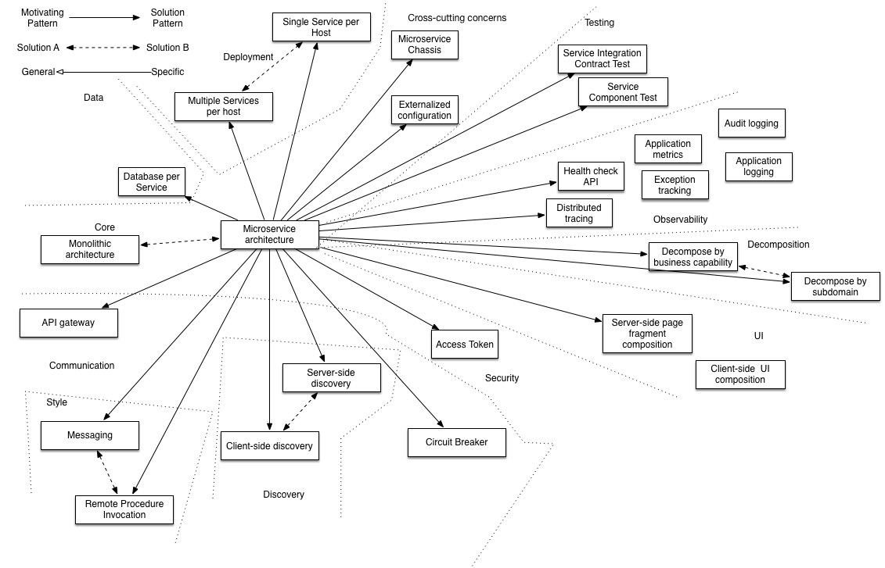

* Table of Contents
{:toc}

--------------------------------------------------------------------------------------------------------------------

[Source for below](https://www.freecodecamp.org/news/software-design/)

# Clean code: Best practices

- Powerful names over comments
- Indentation and style
- Pure functions
- Keep methods, classes, files small
- Refactor switch statements to classes
- Don't pass booleans and nulls
- Refactor often

<!-- # Programming paradigms

## Structured programming

## Functional programming

## Object-oriented programming
### Primary principles
- Inheritance
- Polymorphism
- Abstraction
- Encapsulation

### Paradigm features
- Abstract classes
- Concrete classes
- Scope/visibility
- Interfaces

### Model driven design
- Domain models
- Anemic models
- Layered architecture
- Domain language
- Class invariants

# Design Principles
## Composition over inheritance
## Encapsulate what varies
## Program against abstractions
## Hollywood principle
## SOLID
## DRY
## YAGNI -->

# Design Paterns

## Facade pattern

Has a facade which is an object that serves as a front-facing interface masking more complex underlying or structural code.

**Benefit:**
- improve readability and usability of a software library by masking interaction with more complex components behind a single API
- provide a context-specific interface to more generic functionality
- serve as a launching point for broader refactor of monolithic or tightly coupled systems in facour of more loosely coupled code.

[Facade Pattern Wikipedia](https://en.wikipedia.org/wiki/Facade_pattern)

<!-- ## Singleton pattern
## Factory pattern
## Builder pattern
## Adapter pattern

# Architectural Principles

## Policy vs detail
## Coupling and cohesion
## Component principles
## Boundaries -->

# Architectural styles
## Structural

### Monolithic
- is the traditional architectural style
- Disadvantages:
  - harder to scale deployment, need to run multiple instance of the app on multiple machines
  - harder to scale when app becomes large and team grows in size (app might take longer to start up, codebase might get too big, IDE slows down, tight coupling between unrelated components, requires long term commitment to a tech stack)
- Advantage:
  - Simpler to develop, test, deploy

### Microservice
Structures an application as a collection of services that are:
- highly maintainable and testable
- loosely coupled
- independently deployable
- organized around business capabilities
- owned by a small team

**Advantages:**
- enables continuous delivery
- each microservice is small, easier for developer to understand, faster IDE
- improved fault isolation
- don't need long term commitment to a tech stack

**Disadvantages:** 
- additional complexity of creating a distributed system
- deployment complexity
- increased memory consumption (each microservice running its own server)

[Website](https://microservices.io/patterns/microservices.html)

**Microservice API Gateway**

Instead of letting client communicate with each microservice directly, we use an API gateway which serves as a single entry point to the system. (Similar to [Facade pattern](#facade-pattern)) The API gateway will be responsible for request routing, composition, and protocol translation.

- Benefits:
  - encapsulates internal structure of the application
  - simplifies client code (since it provides each kind of client with a specific API)
- Drawbacks:
  - risk in becoming development bottleneck (since developers need to update the API gateway in order to expose each microservice's endpoints)

Implementing API gateway:
- Ensure high performance and scalability
- use a reactive programming model to minimize response time by performing independent requests concurrently
- Service invocation (since microservice based application is a distributed system and must use an inter-process communication mechanism, can use either message-based mechanism or synchronous mechanism like HTTP or Thrift)
- Service Discovery (for API gateway to know the ip address and port of each microservice, can be hardcoded for traditional servers but for cloud based apps, need to have dynamically assigned locations because of autoscaling and upgrades)
- Handling partial failures (if one microservice is slow or unavailable, should return the rest of the info fetched or use cached data)

<!-- ### Layered

## Messaging
- Event driven
- Publish-subscribe

## Distributed
- Client-server
- Peer to peer

# Architectural Patterns
## Domain driven design
## Model view controller
## Blackboard pattern
## Microkernal
## CQRS
## Event sourcing

# Enterprise patterns
## DTOs
## Identity Maps
## Use cases
## Repositories
## Mappers
## Transaction script
## Commands/Queries
## Value objects
## Domain models
## Entities
## ORMs -->