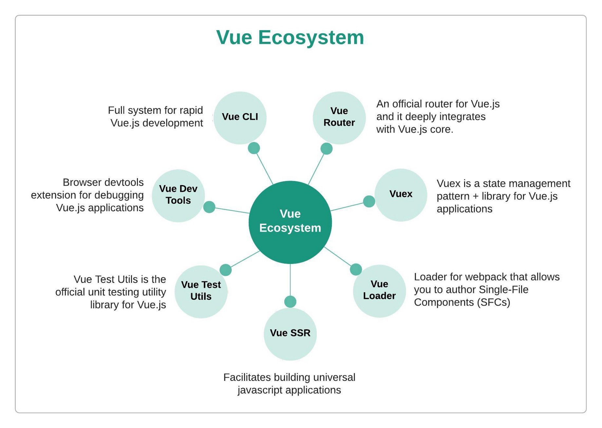
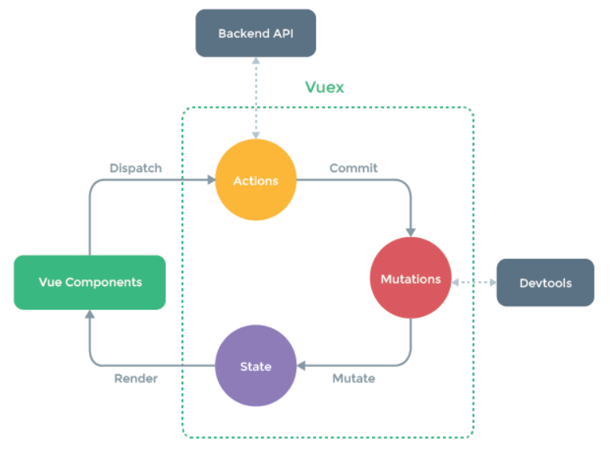

* Table of Contents
{:toc}

--------------------------------------------------------------------------------------------------------------------

# Frontend

## Vue Ecosystem

## Concept: Caching for frontend

In my previous projects, I have come to realise that my websites have low performance (high latency) and I think that this is because I didn't do any caching on the frontend. Hence I want to do frontend caching for this project to increase performance.

Caching provides speedy navigation and greater control over what is stored by avoiding unnecessary requests to the backend. The purpose of caching is to reduce the number of interactions between frontend and backend. For example, when you need the list of store items in homepage and also in products page, we don't want to be fetching the list of store items every time the user navigates from the homepage to the products page, so we cache it, and only fetch or update the cache when we update the data fetched. For my money game, there is nowhere the user can navigate to, hence caching will not benefit us in this aspect.

## Design Decision: Whether to use Vuex

**(Theory)** I have seen cases where people put all their API calls inside the Vuex store, and dont do API calls anywhere else. [This stack overflow answer](https://stackoverflow.com/questions/57710800/when-should-i-use-vuex) says that the main purpose of using Vuex is to have a single source of truth for your data. Rather than allowing one particular component to update data directly, we delegate the updating of data to a separate module, the store. So any component using that data will be notified about the change. This helps to prevent cyclic update loops. But sometimes this pattern is overused because it doesnt make sense to keep data that is only used by one component in the store. Since no other component needs to know about any changes to the data, it should be managed in the component using it. Vuex is also great for enabling server side rendering.

**Pros:**
- Makes app easily extendible. Although it is unlikely that we will be extending on this app, we never know what could happen in the future, so I think that it is good to make the app as extendible as possible.
- Can learn how to use Vuex for future more complex projects.

**Cons:**
- Greater implementation costs
- Might seem redundant for this simple app

## Concept: Vuex

This diagram gives a good overview of how vuex works. This was taken from [vuex official documentation](https://vuex.vuejs.org/#what-is-a-state-management-pattern).

## Read up: Webpacks

According to [Wikipedia](https://en.wikipedia.org/wiki/Webpack), webpack is an open-source JavaScript module bundler. It is made primarily for JavaScript, but it can transform front-end assets such as HTML, CSS, and images if the corresponding loaders are included. webpack takes modules with dependencies and generates static assets representing those modules. Webpack takes the dependencies and generates a dependency graph allowing web developers to use a modular approach for their web application development purposes. It can be used from the command line, or can be configured using a configuration file which is named webpack.config.js. This file is used to define rules, plugins, etc., for a project. (webpack is highly extensible via rules which allow developers to write custom tasks that they want to perform when bundling files together.)

So I believe that webpacks are a way of managing dependencies?

At first, websites were small bundles of html,css and js files. But to make making websites easier, we introduces new libraries, frameworks and design patterns (like vue, react) to give developers a more powerful and simpler way of writing javascript applications. The drawback is the it creates large amounts of files which impacted storage and performance. So they started to provide mechanisms for splitting javascript programs up into separate modules that can be imported when needed. Some javascript libraries and frameworks that enable module usage is RequireJS, webpack, and babel. Modern browsers have also started to support module usage, by optimizing loading of modules, making it more efficient than having to use a library. (What's the difference between using a library and modules?)

## Read up: Code splitting

## Read up: Polyfills

## Next.js

Benefits of using Next.js:
- Better performance, eg bundling, code splitting for faster page loads
  - Our attendance application handles a lot of data, and could benefit from the performance benefits of using Next.js.
- Search engine optimization
  - There's not a lot of content in our application, and growing the usage of our application is not really the main goal of our project.
- Server-side rendering, pre-rendering of pages
  - Can have performance benefits, but learning curve and short timeline for project likely doesn't justify the performance benefits
- Page based routing system
  - reported issues with dynamic routing, backend seems to want dynamic routing
- Built in CSS and Sass support

## TypeScript VS Javascript

Benefits of using TypeScript:
- Can define prop types, reducing potential for bugs
- Better code completion with jsx and better intellisense, auto import
- More readable and confidence in code

Costs:
- Learning curve
- third party libraries might not support typescript
- Slightly longer compilation time
- Need to write more code

## Choice of design system: Material UI VS Chakra UI

UI component required | Material UI | Chakra UI
--- | --- | --- 
Form input (username, password, confirm password, text) | can do validation, have the basic form input boxes | I like how chakra ui has an editable component, that would be very useful, but we are not allowing people to edit the member names in this version, so i dont know how important that component would be. it has the basic input form boxes
Button | abit uglier because they capitalize the words by default | nicer buttons than material ui, can add icons and button loading state
Datepicker, select | Have datepicker (in mui lab) and nice dropdown | no built in datepicker, has basic dropdown
Tags (for member names) | called chips, has built in deletable prop | has tags and also built in deletable prop
Checkbox for attendance | have nice radio and checkboxes | have acceptable radio and checkboxes
Modal for forms | basic modal is a little ugly,, can consider using dialogs also | have nicer modals
Popup to instruct users to use the app | dont really have popup | can use tooltip for this
Table for attendance table | basic table looks okay, but need to style using styled function to customize color | seems similar to material ui table
Cards for attendance books | might be hard to use cards out of the box, might want to create own card component | doesn't have card component... :(
Header? | can use app bar | don't really have something i can use for header
Icons | has built in icons | also has built in icons

Why Material UI:
- It seems to be [easy to do color customization](https://medium.com/swlh/create-a-customized-color-theme-in-material-ui-7205163e541f) in material ui also, which is often troublesome with most UI libraries. 
- In general it seems that the material UI components come with more features compared to chakra UI. 

Why Chakra UI:
- Seems like Chakra UI can also do themes quite easily in a similar way as material ui, furthermore, chakra ui allows for [custom css to style the components, and allow css variables so we wont have to duplciate theme values](https://chakra-ui.com/docs/features/css-variables).
- Chakra seems to be more focused on creation of flexible, composable and scalable code
- Supposed to be easier to customize than material UI

## Best Practice: When to use functional components and class components in React

Use functional components when it doesn't need a state, use class when you need state. Use FC when they simply accept data and display them in some form (usually not interactive). But react hooks allow you to access state and all in functional components.

## Best practice (before react hooks): React render props pattern

Sharing code between react components using a prop whose value is a function.

Traditionally, if we have 2 components that are similar, we can abstract it out by abstracting common logic (like state and methods), and placing it into a wrapper component into the state. This is passing a react component into a wrapper component as a prop. We do this when we want to abstract out common logic (methods) and state from 2 components with different styling. (This is when we can't abstract out by changing the styling using props.)

[Video explaining render props pattern](https://www.youtube.com/watch?v=3IdCQ7QAs38)

## Best practice (before react hooks): Higher order component pattern

If we have multiple component doing the same logic (increment count method, and count variable in state), but have slightly different displays, `Hovered X times` vs `Clicked X times` then a lot of code duplication. If both components have same parent component, we can simply lift the state of count into parent, and pass the handlers as props. But if they have different parents, will have duplicate state and handlers everywhere still.

This one is basically adding a wrapper around the component which adds a specific function/feature to the original component. (eg. passing an additional prop) For reducing duplication, we would be putting the common logic into this higher order component. I think this is similar to react context, except that react context is for props and HOCs are for things like state and methods.

## Best practice: React context

Use react context to make a prop value available throughout everything wrapped within the context. (can use `useContext` hook to access it, in place of `Consumer` component)

## Best practice:

Use react hooks to abstract out common logic/state.

[Video explaining react hooks](https://www.youtube.com/watch?v=TNhaISOUy6Q)

## Micro Frontend

- increased reusability of components
- separate one big frontend into many small apps
  - eg. each page could be its own app, served on a different localhost port
  - change webpack config to expose some shared components to be used by other apps
- make it easier for different teams to work on the same frontend

*Organisms is most appropriate layer to share
