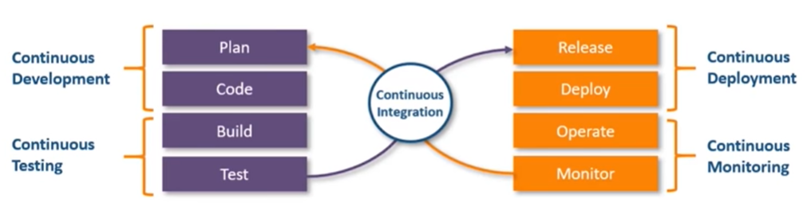
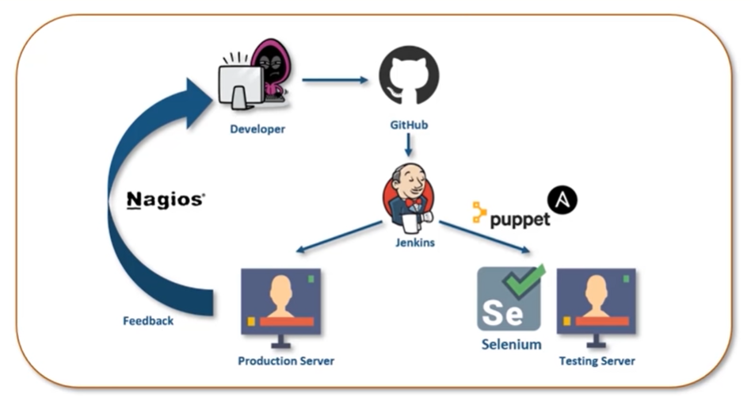

* Table of Contents
{:toc}

--------------------------------------------------------------------------------------------------------------------
# DevOps

DevOps is a set of practices that combines software development and IT operations. It aims to shorten the systems development life cycle and provide continuous delivery with high software quality.
[Source](https://en.wikipedia.org/wiki/DevOps)

**DevOps Automation: Continuous __**

**CI/CD Pipeline**

**DevOps Tools**

[Source](https://www.youtube.com/watch?v=JHoy3lDZOfY)

## Different environments

But because there are so many different environments, might cause the issue of the code working on one environment, but not working on another environment. Hence we put our code into containers which are isolated and standardized environments so as to ensure that the code working on one environment will be working on other environments. Dev side will put code into container and ops side will use the container and do what they need to do.

# Deployment

All the code we write needs to be put onto a server, usually frontend code put onto one server, backend code put onto another server. A server is just a public computer. The act of putting a code onto a public computer is called deployment.

## Continuous deployment

### Virtualization and containerization

Solves issue of code running on one env and not on another env. Containers wrap your software together with its dependencies, allowing it to be run on any system.

### Configuration management

Other dependencies such as Docker, Python that needs to be downloaded on the server can be set up using a script. 

## Servers

A server is a computer dedicated to provide specific services. Larger companies have 1 server dedicated for storing data, 1 server for serving web requests, 1 server for handling emails. But smaller companies usually have all 3 services on 1 server.

Communicate between client and server or server and server through network.

Desktop computers can't act as server because of hardware limitations and also software limitations because the OS only can handle a limited number of concurrent connections. There are specialized processors and RAM and OSes like Linux, Windows Server, macOS server etc.

Different types of servers: web server, database server, email server.

[Source](https://www.youtube.com/watch?v=UjCDWCeHCzY)

## Cloud computing

Traditionally, the physical servers are managed by individuals, organizations etc. If we wanted access to emails, we would have to maintain an email server. If there were any hardware or software issues with the server, it would need maintenance and might be hard to repair.

Cloud computing is organizations that own lots of strong powerful servers in a data center, and offer them as a service. More cost efficient to use cloud usually.

Efficient, reliable, scalable. Major cloud providers: Amazon Web Services, Microsoft Azure, Google Cloud Platform, IBM, Alibaba.

Netflix uses AWS :O

Different types of cloud computing: **Infrastructure as a Service (Iaas)** - you control software like applications, data, OS, middleware, runtime, while cloud provider control hardware like servers, virtualization, storage, networking etc. **Platform as a service (Paas)** - you only control applications and data, **Software as a service (Saas)** - everything on cloud provider, like google docs

[Source](https://www.youtube.com/watch?v=_a6us8kaq0g)

## Concept: Web Communication

**Why do we need a web server?**

A web server like NGINX communicates with the outside world (ie. calling external api or backend api). The frontend code lives on the web server.

Some browser requests (like html forms) don't have simple responses, so the browser needs to invoke an external script to process the html form input to get a response. In reality, the browser tells the web server that it wants to process a html form, then the web server forks a process (which inherits parent's environment variables, and executes the process to process a html form). 

When the browser generates html pages, NGINX passes it to gunicorn and flask, then flask will generate another page and send it to gunicorn, and sends it back to NGINX which sends it back to browser.

**Why do we need CGI and WSGI?**

Its hard to have a standardized script because everyone names environment variables differently, so cannot just fetch based on env variable name. Hence Common Gateway Interface (CGI) was born, it standardizes the environment variables names and their purpose.

WSGI takes it a step further to standardize the way that the script is called. There will be a python function defined in the wsgi.py file, the first param is cgi env variables (in a python dictionary), then the second is another function that must be called once inside the python function. The purpose of WSGI is to standardize the way that external scripts are executed by web servers. Flask supports WSGI, WSGI is a communication protocol, between client web application and also server code.

**Why do we need an application server?**

We need gunicorn because loading external scripts takes a long time. The bottleneck of processing requests is the time it takes for web server to load python binary from hard drive and starting a new process (forking). 

**Solution:** pre-forking, starting the forking process when the web server is idle. Forking 3 times gives you 3 web server workers. Workers are in memory instances of python interpretor. pre-forking is web server functionality. NGINX cant prefork WSGI apps but can forward HTTP requests to another web server (gunicorn which understands HTTP requests) which can prefork your WSGI app.

## Concept: Web hosting

DNS server translates domain into an IP address, its a form of mapping.

When a hosting provider allocates space on a web server for a website to store its files, they are hosting a website. Web hosting makes the files that comprise a website (code, images, etc.) available for viewing online. Every website you’ve ever visited is hosted on a server. ([Source](https://www.namecheap.com/hosting/what-is-web-hosting-definition/))

The amount of space allocated on a server to a website depends on the type of hosting. The main types of hosting are shared, dedicated, VPS and reseller. They are differentiated by the kind of technology used for the server, the level of management provided and the additional services on offer.

Basically when you have the code for the website, you need to put that code onto a publicly available computer (ie. a web server) so that people can access it, then you need to link that publicly available computer to a domain name.

## Concept: Containerization in Web development

Containers isolate software from its environment and ensure that it works uniformly despite differences (eg. between development and production) ([Source](https://www.docker.com/resources/what-container)) Containers are a solution to the problem of how to get software to run reliably when moved from one computing environment to another. (eg. from physical machine to virtual machine in cloud)

## References
- [All you need to know about WSGI youtube video](https://www.youtube.com/watch?v=UklcIDgHtwQ)

